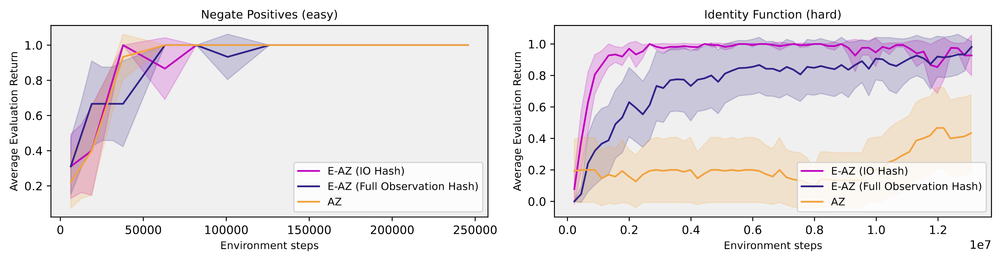

# e-alphazero

This repository contains an implementation of Epistemic AlphaZero which is an modification of [AlphaZero]
that uses Epistemic Monte Carlo Tree Search ([E-MCTS]). We use [JAX] to make efficient use of GPU acceleration.
Our framework is compatible with [pgx] environments, and in fact we implement two new ones: DeepSea and Subleq, (see `src/envs/`).

See also [emctx], a fork of [mctx] which supports epistemic uncertainty propagation as described in the E-MCTS paper.

## Structure

- The program in `src/`:
    - The entry is `main.py`.
    - Self-play (i.e. environment interaction) is in `selfplay.py`.
    - Replay buffer [reanalyze] is in `reanalyze.py`.
    - Evaluation (i.e. determining strength) is in `evaluate.py`.
    - Network training (i.e. policy and value improvement) is in `train.py`.
    - Config options are in `config.py`, and the context that is created from them is in `context.py`.
- Custom Environments are in `envs/`.
- Network architectures and hashing algorithms (for uncertainty estimation) are in `network/`.
- Scripts for submitting experiments and analysis are in `scripts/`.

## Usage

1. Install [Python].
2. Install `pipenv` with `pip install --user pipenv`.
3. Run `pipenv install` in this directory to install the required dependencies.
4. Run `pipenv run python src/main.py` with optional configuration specified as space-separated `parameter=value`.

[AlphaZero]: https://arxiv.org/abs/1712.01815
[E-MCTS]: https://arxiv.org/abs/2210.13455v5
[JAX]: https://github.com/jax-ml/jax
[pgx]: https://github.com/sotetsuk/pgx
[emctx]: https://github.com/emcts/emctx
[mctx]: https://github.com/google-deepmind/mctx
[Reanalyze]: https://arxiv.org/abs/2104.06294
[Python]: https://www.python.org/downloads/
[uv]: https://docs.astral.sh/uv/
